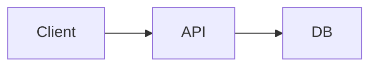

# docs/AGENTS.md

`docs/` 以下のドキュメント全体の索引。必要な情報がどのファイルにあるかを把握するためのエントリポイント。

---

## プロダクト概要

<!-- TODO: 何を作るか / 対象ユーザー / 主要な価値を 2〜3 行で記述 -->

- プロダクト名：
- 一言で：
- 対象ユーザー：
- 主要機能：
- 開発フェーズ：

---

## ファイルマップ

| ファイル | 役割 | 参照タイミング |
|---|---|---|
| `specification.md` | 全体ビジョン・課題・スコープ・進め方 | 仕様の背景・根拠を確認したいとき |
| `details/feature-list.md` | 機能一覧と優先度（P0〜P3） | 機能の取捨選択・スコープ管理 |
| `details/tech-stack.md` | 技術選定と採用理由 | 依存・技術判断をするとき |
| `details/screen-flow.md` | 画面遷移・操作フロー | UX / 画面実装 |
| `details/permission-design.md` | 権限設計（RBAC / ABAC） | 認可ロジック設計 |
| `details/directory.md` | ディレクトリ構成 | 新規ファイルの配置場所 |
| `details/infrastructure.md` | インフラ構成 | インフラ変更時 |
| `details/process-flow.md` | 同期 / 非同期の処理フロー | 連携・非同期処理 |

---

## アーキテクチャ概要

<!-- TODO: システム全体の流れを 1 行図 + mermaid で示す -->

