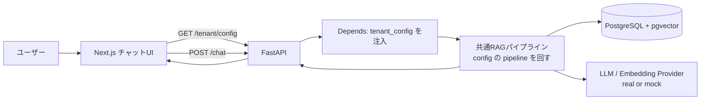

# docs/AGENTS.md

`docs/` 以下のドキュメント全体の索引。必要な情報がどのファイルにあるかを把握するためのエントリポイント。

---

## プロダクト概要

- **プロダクト名**：Elith RAG（企業向けRAGチャット基盤 / 仮称）
- **一言で**：標準的なRAGチャットを基盤にし、顧客ごとの差分を **設定（`tenant_config`）で吸収** するマルチテナント・プロダクト
- **対象ユーザー**：A社（東雲ビジネスサポート）/ B社（みなと製作所）/ C社（青葉クリニックグループ）。今回は **A社を実装**
- **主要機能**：ナレッジ取り込み → 検索 → 引用付き回答 → 根拠不足/警告の表示 → フィードバック蓄積
- **開発フェーズ**：MVP =「標準RAG」+「A社向け追加機能」+「共通化判断」
- **最重要思想**：**顧客差分はコードでなくデータ。リポジトリのフォークも、テナントごとのコード分岐も作らない。** 詳細は `details/multi-tenant-design.md`

---

## ファイルマップ

| ファイル | 役割 | 参照タイミング |
|---|---|---|
| `specification.md` | 全体ビジョン・課題・スコープ・進め方 | 仕様の背景・根拠を確認したいとき |
| `details/multi-tenant-design.md` | **本プロダクトの背骨。** config駆動マルチテナント / 顧客固有・設定吸収・共通還元の切り分け / `tenant_config` スキーマ | 設計判断の基準・差分の置き場所を確認するとき |
| `details/feature-list.md` | 機能一覧と優先度（標準RAG / A社追加 / 共通還元 / Nice to have） | 機能の取捨選択・共通化判断 |
| `details/tech-stack.md` | 技術選定と採用理由 | 依存・技術判断をするとき |
| `details/process-flow.md` | `/chat` 同期フロー・取り込みフロー・パイプライン実行 | 連携・処理の流れを実装するとき |
| `details/screen-flow.md` | 画面遷移・config駆動レンダリング | UX / 画面実装 |
| `details/permission-design.md` | テナント境界・回答モード・属性ベースのポリシー | 認可・データ分離・出力制御 |
| `details/directory.md` | レイヤ別ディレクトリ構成（テナント別ディレクトリは作らない） | 新規ファイルの配置場所 |
| `details/infrastructure.md` | GCP想定構成（Cloud Run / Cloud SQL+pgvector） | インフラ・デプロイ |

---

## アーキテクチャ概要

> ポイント：`/chat` は全テナント共通。テナント差分は `Depends` が注入する `tenant_config`（データ）として吸収する。

