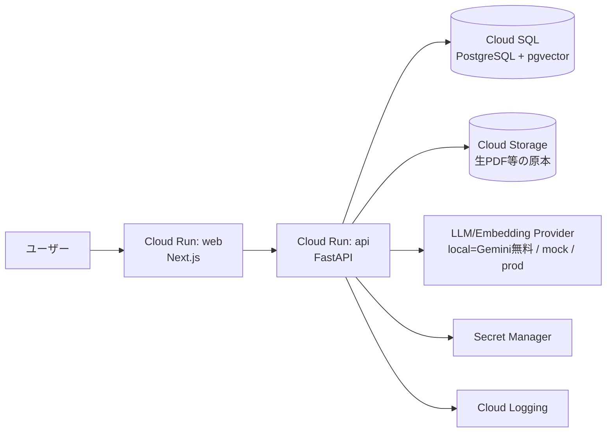

# Infrastructure Guidelines

GCP Cloud Run を想定した構成。実デプロイは必須でなく、READMEに想定構成を記載する。

---

# System Architecture

> 実デプロイはしない。上図は **README の「GCP想定構成」** を表すもので、IaC は Terraform で記述（適用しない）。

---

# System Components

## 1. Request Entry Points

### Web（Next.js / Cloud Run）

- 薄いチャットUI。`GET /tenant/config` でUIを駆動し、`POST /chat` で質問。

### API（FastAPI / Cloud Run）

- `/chat`・`/tenant/config`・`/documents`・`/feedback`。ステートレス・コンテナ化。

## 2. Async Processing（取り込み）

### 取り込み構成

- 文書分割・埋め込み・索引化。規模が小さければAPI内同期、増えればバッチ/非同期に分離。

## 3. Data / Security

### Data Store

- PostgreSQL + pgvector（Cloud SQL）。リレーショナルとベクトルを単一ストアに集約。
- **生PDF等の原本は Cloud Storage（GCS）**。取り込み時に分割・埋め込みして pgvector に索引。

### Security

- 秘密情報は Secret Manager / `.env`。コミットに含めない。全クエリを `tenant_id` でスコープ。

### Provider 抽象（環境で切替）

- LLM/Embedding を interface 化。`.env` の `ENVIRONMENT` で実装を選ぶ：
  - `ENVIRONMENT=local` → **Gemini 無料API**（費用ゼロでローカル動作確認）
  - APIキー無し → **mock**（代替動作）
  - 本番想定 → キーを Secret Manager から注入
- これは「APIキーがない環境でも確認できる」課題要件を満たす。

---

# 設計意図

## pgvector 単一ストアで部品を最小化

- 専用ベクトルDBを足さず、テナント/設定/回答/フィードバックと同居。小規模MVPの運用を簡素化。

## モックで「動く形」を担保するために

- Provider抽象により、APIキーやクラウド費用なしでローカル動作確認できる（課題の必須要件）。

## 差分をデータに寄せて運用コストを抑える

- 新規顧客は `tenant_config` 行の追加で対応。インフラ・デプロイ単位は増えない。

---

# スケーリング戦略

## 水平スケール

| 対象 | 方法 |
|---|---|
| Cloud Run（web/api） | リクエスト数で自動スケール（ステートレス前提） |
| Cloud SQL（PostgreSQL） | 単一構成から段階的にリードレプリカ追加 |
| 取り込み | バッチ/非同期化でスパイク吸収 |

## 局所アクセス対策

- 検索は `tenant_id` + scope で対象を絞り、無駄な近傍検索を避ける。

---

# READMEに書く「GCP想定構成」（課題要件）

- 想定アーキテクチャ / コンテナ化方針 / 環境変数 / 秘密情報の扱い / データ保存先 / ログ確認方法 / 想定コスト / デプロイ手順 / 動作確認観点 / 障害時の切り戻し・暫定対応
