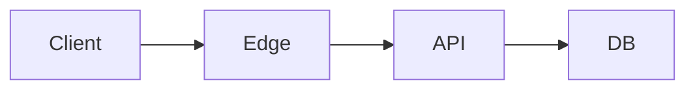

# Infrastructure Guidelines

<!-- インフラ構成の全体方針 -->

---

# System Architecture

<!-- TODO: 全体構成図 -->

---

# System Components

## 1. Request Entry Points

### <チャネルA>

<!-- TODO -->

### <チャネルB>

<!-- TODO -->

## 2. Async Processing（Queue + Worker）

### Queue構成

<!-- TODO -->

### Worker構成

<!-- TODO -->

## 3. Data / Security

### Data Store

<!-- TODO -->

### Security

<!-- TODO -->

### Internal Service Discovery

<!-- TODO -->

---

# 設計意図

## <制約A>を満たすために

<!-- TODO -->

## 運用コストを抑えるために

<!-- TODO -->

## データ整合性と柔軟性を両立するために

<!-- TODO -->

---

# スケーリング戦略

## 水平スケール

| 対象 | 方法 |
|---|---|
|  |  |

## 局所アクセス対策

<!-- TODO -->
