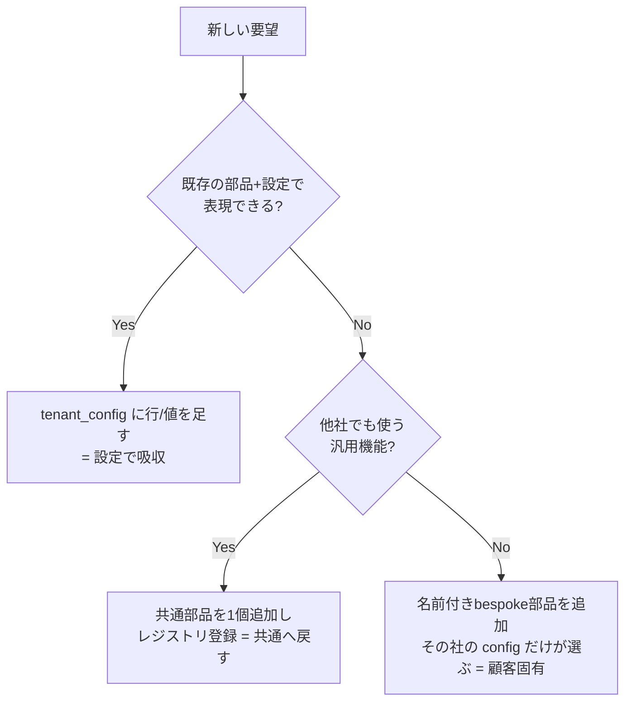

# 🧭 マルチテナント設計（config駆動）

本プロダクトの背骨。**顧客差分はコードでなくデータ（設定）で吸収する**という一点に、全設計が従う。

---

## 0. 設計前提

| 項目 | 内容 |
|---|---|
| 禁止事項 | リポジトリのフォーク / テナントごとのコードディレクトリ分岐 |
| 差分の置き場所 | `tenant_config`（DBの1行 = データ）。コードではない |
| 共通の単位 | `/chat` API・RAGパイプライン・部品（step）はすべて全テナント共通の1本 |
| 評価軸 | 機能数でなく「顧客固有 / 設定で吸収 / 共通へ戻す」の切り分けの明確さ |

---

## 1. 基本思想：差分は「コード」でなく「データ」

> **コード = "やり方"（動詞・できること）**
> **コンフィグ = "そのテナントがどうするかの選択"（データ・設定値）**

たとえ：コーヒーマシン（コード）は「挽く・沸かす・注ぐ」を知っている。お客ごとの注文票（config）には「A社＝濃いめ・砂糖なし・L」と選択だけ書く。**客が増えてもマシンは作り直さない。注文票を差し替える。**

新しいテナント＋新要件が来たときの分岐：

| ケース | やること | コード変更 |
|---|---|---|
| 既存の部品で表現できる | テナント登録 + config を書く | **ゼロ** |
| 新しい振る舞いが要る | **共通の部品を1個追加** → config で有効化 | その部品だけ |
| 真にその社だけのbespoke | 名前付き部品を追加 → **その社の config だけが選ぶ** | その部品だけ |

ポイント：新機能を足すときも **テナント専用ではなく「共通の部品」として足す**。次の顧客が同じ要件を出したら config に名前を足すだけで済む（＝コード変更ゼロに戻る）。これが課題の「共通プロダクト機能として標準RAGへ戻す」。

---

## 2. configは2種類ある（混同しない）

| 種類 | 例 | 役割 | 置き場所 |
|---|---|---|---|
| **環境config** | `.env` / `config.yaml` | アプリ全体の起動条件（DB接続先、APIキー、ポート、使用Provider） | ファイル。環境ごと（dev/prod） |
| **テナントconfig** | `tenant_config` テーブルの行 | **顧客ごとの振る舞い**（回答方針・警告・モード等） | **DB**。顧客は動的に増えるため |

フォークの代わりに使うのは **テナントconfig（後者）**。DBに置く理由：ファイルだと新規顧客のたびにデプロイが要る＝コードと同じ問題に戻る。

例：環境config（`.env`）はProviderの切替に使う。`ENVIRONMENT=local` のとき LLM/Embedding を **Gemini 無料API**（費用ゼロ）に向ける。これはアプリ全体の起動条件＝顧客ごとの振る舞いではないので**テナントconfigではない**。

```dotenv
# .env（環境config — アプリ全体）
ENVIRONMENT=local          # local → Gemini無料API / なければ mock
GEMINI_API_KEY=...         # 無料枠
DATABASE_URL=postgres://...
```

---

## 3. `tenant_config` スキーマ（たたき台）

DBの1行。中身は構造化JSON（`models/tenant_config`）。

```jsonc
{
  "tenant_id": "a_shinonome",
  "display_name": "東雲ビジネスサポート",

  "search": {
    "scope": "all"                       // B社なら部署/設備で絞る等
  },

  "answer": {
    "modes": ["external", "internal"],   // 社外向け / 社内向けを分ける
    "default_mode": "internal",
    "citation": "required",              // 回答に必ず根拠表示
    "low_confidence_action": "needs_review", // 根拠が弱い→断定せず「確認が必要」
    "show_source_metadata": true         // 資料名・更新日・該当箇所を表示
  },

  // 共通カタログの部品名を、実行順に並べる
  "pipeline": ["retrieve", "stale_warning", "contradiction_check", "ground_check", "cite"],

  "warnings": {
    "stale_sources": true,               // 古い/更新待ち資料を参照したら警告
    "contradiction": true                // 複数資料が矛盾したら可能性を表示
  },

  "category_policies": {                 // 問い合わせカテゴリごとに方針を変える
    "billing":  { "tone": "formal" },
    "contract": { "require_human_check": true }
  },

  "feedback": {
    "enabled": true,
    "reason_categories": ["古い根拠", "誤った引用", "表現が不適切"] // 悪い評価の理由カテゴリ
  }
}
```

各フィールドはPDFのA社要望に1対1で対応する（右コメント参照）。**要望が「コード」でなく「データの項目」に化けている**のが本設計の肝。

---

## 4. A社・B社・C社は「同じ構造・値違い」

3社の差は別APIでも別ディレクトリでもなく、**同じスキーマの値違い**として表れる（B/C社は今回未実装だが、設定で表現できることを示す）。

| 観点 | A社 | B社 | C社 |
|---|---|---|---|
| `search.scope` | all | 部署/ライン/設備で絞る | 拠点で絞る |
| 重視する warning | 古資料 / 矛盾 | 安全注意事項 / 正式vs現場メモ差分 | 医療判断の制限 / PII注意 |
| `answer.modes` | 社外 / 社内 | 現場（短く）/ 管理者（詳しく） | 患者向け / 社内確認用 |
| bespoke部品 | （不要、設定で吸収） | 危険作業の検知警告 | 医療エスカレーション判定 |

---

## 5. レイヤ分離（`Depends` / パイプライン / プロンプト）

```python
# Depends = テナントの設定(データ)を取ってくるだけ。判断はしない
def get_tenant_config(tenant_id: str) -> TenantConfig:
    return repo.load_config(tenant_id)        # load one row from DB

# 共通パイプライン = 設定を読んで振る舞いを変えるだけ（全テナント共通の1個）
def run_pipeline(query: str, cfg: TenantConfig):
    chunks = retrieve(query, scope=cfg.search.scope)
    for step in cfg.pipeline:                 # run steps named in the config
        chunks = STEPS[step](chunks, cfg)
    answer = generate(build_prompt(cfg, chunks))  # prompt layer reflects config into policy
    return answer
```

- **Depends**：現在の顧客コンテキスト（config）を注入する入口。プロンプトは作らない。
- **共通パイプライン**：検索の絞り込み・引用・根拠不足判定・古資料警告・回答モード切替を共通処理として実行。
- **プロンプト層**：config を回答方針に反映する。

---

## 6. 新要件が来たときの判断フロー



この判断そのものが提出物「FDE判断メモ」になる。

---

## 7. 課題の3分類へのマッピング

| 課題の分類 | 本設計での実体 |
|---|---|
| **設定で吸収するもの** | `tenant_config` の行（既存部品の組み合わせ・パラメータ） |
| **共通機能として戻すもの** | 共通パイプラインに登録した名前付き部品（全テナントが config で有効化可能） |
| **顧客固有対応として残すもの** | その社の config だけが選ぶ bespoke 部品（理由付きで明記） |
