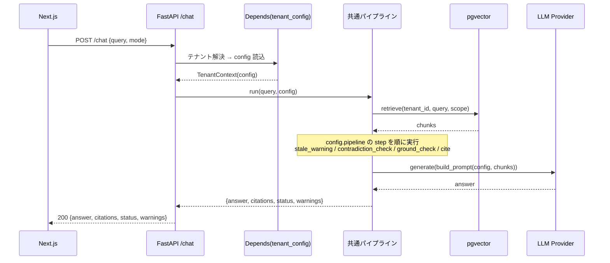
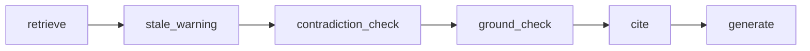
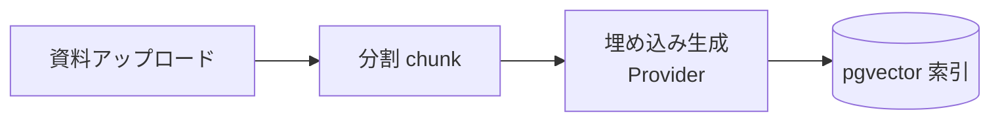
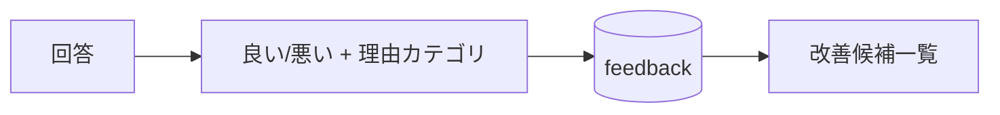

# 🔄 処理フロー設計

`/chat` は全テナント共通。テナント差分は `Depends` が注入する `tenant_config` で吸収する。

---

## 0. 設計前提

| 項目 | 内容 |
|---|---|
| チャット応答 | 同期（リクエスト/レスポンス） |
| ドキュメント取り込み | 非同期 or バッチ（規模に応じて選択） |
| テナント解決 | `Depends` の入口で1回（サブドメイン/セッション、`screen-flow.md`） |
| 主要コンポーネント | FastAPI / 共通パイプライン / pgvector / Provider(real or mock) |

---

## 1. フェーズ分割

### 1.1 テナント解決フェーズ（Depends）

- リクエストからテナントを特定し、`tenant_config` をDBから1行読む。
- ここでは **判断やプロンプト生成をしない**。コンテキスト（config）を用意するだけ。

### 1.2 実行フェーズ（共通パイプライン）

- config の `pipeline` に並んだ部品を順に実行し、回答・引用・ステータス・警告を組み立てる。

---

## 2. `/chat` フロー（同期）

### 2.1 パイプライン実行（部品の順次適用）

- どの部品が並ぶかは `config.pipeline`（データ）。部品自体は共通カタログ（`rag/steps/`）。
- `ground_check`：回答が引用に基づくか簡易確認。弱ければ `status = needs_review`。
- `stale_warning`：`updated_at` / `status` メタを見て古資料/更新待ちを警告。
- `contradiction_check`：複数チャンクの食い違いを検知し矛盾可能性を付与。
- `cite`：`citation: required` なら根拠なしの断定を抑止し、資料メタを添付。

---

## 3. ドキュメント取り込みフロー（非同期/バッチ）

- すべて `tenant_id`・`workspace` スコープで保存。
- Provider は real / mock を差し替え可能（APIキー無し環境でも索引まで確認できる）。

---

## 4. 回答品質の運用フロー（フィードバック）

- 「回答できなかった質問」「悪い評価」を改善候補として蓄積（B/C社にも流用できる共通機能）。

---

## 5. エラー / 例外フロー

### 5.1 根拠不足

- `ground_check` が弱いと判定 → 断定せず `status = needs_review`、「確認が必要」を返す。

### 5.2 データなし（検索ヒット0）

- 推測で補わず、「該当資料が見つからない」旨と確認導線（担当部署等）を返す。

### 5.3 Provider/外部失敗

- LLM/Embedding 失敗時はユーザに分かるメッセージを返す。秘密情報を全文ログ出力しない。
