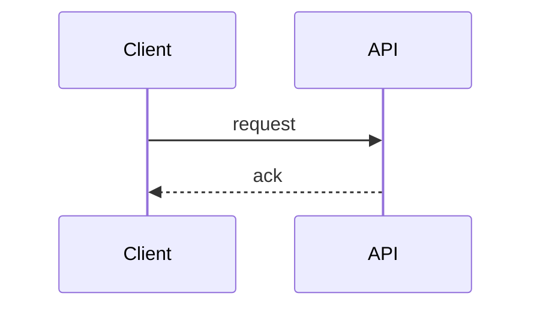
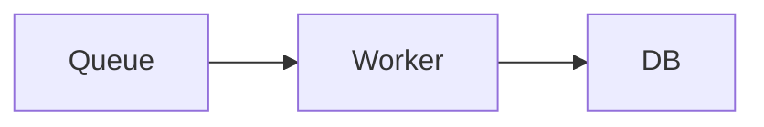

# 🔄 処理フロー設計（MVP / 同期・非同期パターン）

<!-- 受信（同期）と実行（非同期）を分離した処理フローを記述する。 -->

---

## 0. 設計前提

| 項目 | 内容 |
|---|---|
| 対象機能 |  |
| イベントソース |  |
| 主要コンポーネント |  |

---

## 1. フェーズ分割

### 1.1 受信フェーズ（同期・ここでHTTP処理は終了）

<!-- TODO -->

### 1.2 実行フェーズ（非同期・受信後に別処理として実行）

<!-- TODO -->

---

## 2. `<機能A>` フロー

### 2.1 受信フロー（同期）

### 2.2 実行フロー（非同期）

---

## 3. `<機能B>` フロー

### 3.1 受信フロー（同期）

<!-- TODO -->

### 3.2 実行フロー（非同期）

<!-- TODO -->

---

## 4. `<機能C>` フロー

### 4.1 受信フロー（同期）

<!-- TODO -->

### 4.2 実行フロー（非同期）

<!-- TODO -->

---

## 5. エラーフロー分離

### 5.1 受信フェーズの失敗（同期）

<!-- TODO -->

### 5.2 実行フェーズの失敗（非同期）

<!-- TODO -->
