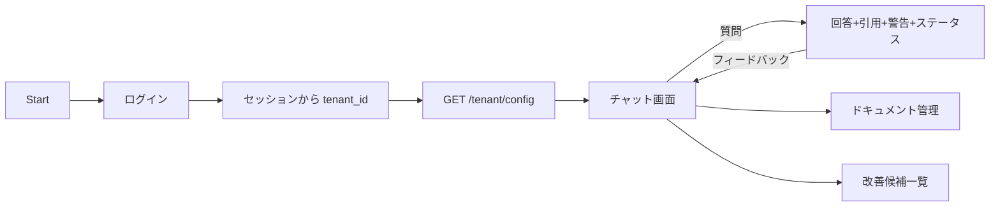
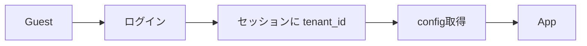
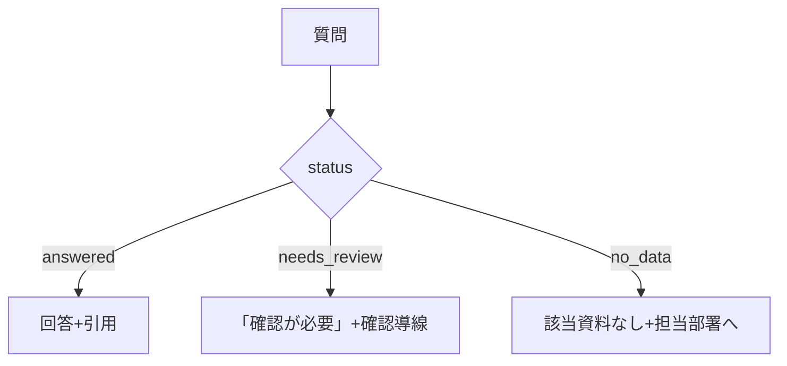
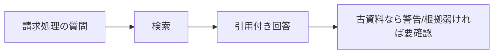

# 🖥️ 画面遷移設計

フロントもテナント別コンポーネントを作らない。**`GET /tenant/config` を取得し、汎用コンポーネントが条件付きレンダリング**する（config駆動）。

---

## 0. 設計前提

| 項目 | 内容 |
|---|---|
| レンダリング | config駆動（テナント別ツリーを作らない） |
| テナント解決 | **ログインセッションから tenant_id を取得**（確定） |
| フロントの責務 | 設定オブジェクトを受け取り描くだけ。テナント名を知る必要はない |

---

## 1. 画面/操作面一覧（Screen Inventory）

### 1-1. Web App

| 画面 | パス | 概要 |
|---|---|---|
| チャット | `/` | 質問入力・回答・引用・警告・ステータス |
| ドキュメント | `/documents` | 取り込み・一覧（管理） |
| 改善候補 | `/review` | 悪い評価/未回答の一覧 |

---

## 2. 全体遷移図（高レベル）

---

## 3. 認証 / テナント解決フロー

- **確定**：テナントはログインセッション（認証ID）から引く。`Depends` の入力源と一致。
- ローカルのデモ用に限り `X-Tenant-ID` ヘッダで手早く切替可（**local限定**、本番はセッションのみ）。
- 将来 独自URL/顧客別IdP（SSO）が必要になればサブドメイン方式を検討（今回は不要）。

---

## 4. config駆動レンダリング（標準テンプレ）

`GET /tenant/config` の結果でUIを組み立てる：

| config | UIの振る舞い |
|---|---|
| `answer.modes` | モード切替トグルの表示/選択肢 |
| `answer.citation = required` | 引用パネルを常時表示 |
| `answer.show_source_metadata` | 資料名・更新日・該当箇所を表示 |
| `warnings.*` | 警告バナーの種類 |
| `feedback.reason_categories` | 悪い評価時の理由カテゴリ |

---

## 5. 状態別分岐（回答ステータス）

---

## 6. 権限制御（画面）

| モード/属性 | 表示 |
|---|---|
| internal | 判断理由・根拠資料を詳細表示 |
| external | 丁寧表現、社内専用情報は非表示 |

---

## 7. モーダル・非同期操作

- ドキュメント取り込みは非同期。進捗/完了をUIに反映（処理中→索引完了）。

---

## 8. エラーフロー（Web App）

| ケース | UI |
|---|---|
| 検索ヒット0 | 「該当資料が見つからない」+確認導線 |
| Provider失敗 | 分かるエラーメッセージ（秘密情報を出さない） |

---

## 9. 空状態 / 初回体験

- ドキュメント未取り込み時：サンプルデータ投入の導線を表示。

---

## 10. URL設計テンプレ（Web App）

| 画面 | URL |
|---|---|
| チャット | `/` |
| ドキュメント | `/documents` |
| 改善候補 | `/review` |

---

## 11. チャネル別シナリオ遷移

### 11-1. 質問〜回答（A社）

### 11-2. 社外/社内モード切替

- 同じ質問でモードを切替えると、出力の詳しさ・表現が変わる（config `answer.modes`）。

### 11-3. フィードバック〜改善候補

- 悪い評価＋理由カテゴリ → `/review` に蓄積され、品質改善の運用に乗る。
