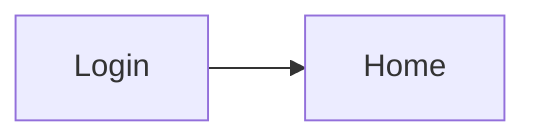
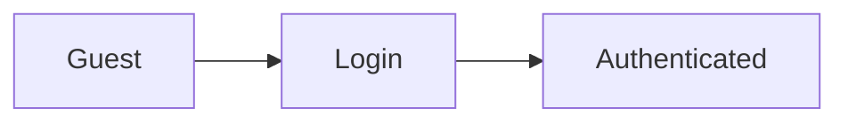

# 🖥️ screen-flow.md

<!-- 画面・操作面の一覧と遷移を記述する。 -->

---

## 0. 設計前提

| 項目 | 内容 |
|---|---|
|  |  |

---

## 1. 画面/操作面一覧（Screen Inventory）

### 1-1. Web App

| 画面 | パス | 概要 |
|---|---|---|
|  |  |  |

### 1-2. <チャネルB>

<!-- TODO -->

---

## 2. 全体遷移図（高レベル）

### 2-1. Web App

### 2-2. <チャネルB>

<!-- TODO -->

---

## 3. 認証フロー

---

## 4. CRUD標準遷移テンプレ（Web App）

<!-- TODO: 一覧 → 詳細 → 作成 / 編集 / 削除 の標準パターン -->

---

## 5. 状態別分岐（State-based Flow）

<!-- TODO -->

---

## 6. 権限制御（チャネル別）

| ロール | 可能な操作 |
|---|---|
|  |  |

---

## 7. モーダル・非同期操作（チャネル別）

<!-- TODO -->

---

## 8. エラーフロー（Web App）

<!-- TODO -->

---

## 9. 空状態 / 初回体験（Web App）

<!-- TODO -->

---

## 10. URL設計テンプレ（Web App）

| 画面 | URL |
|---|---|
|  |  |

---

## 11. チャネル別シナリオ遷移

### 11-1. <シナリオA>

<!-- TODO -->

### 11-2. <シナリオB>

<!-- TODO -->

### 11-3. <シナリオC>

<!-- TODO -->
